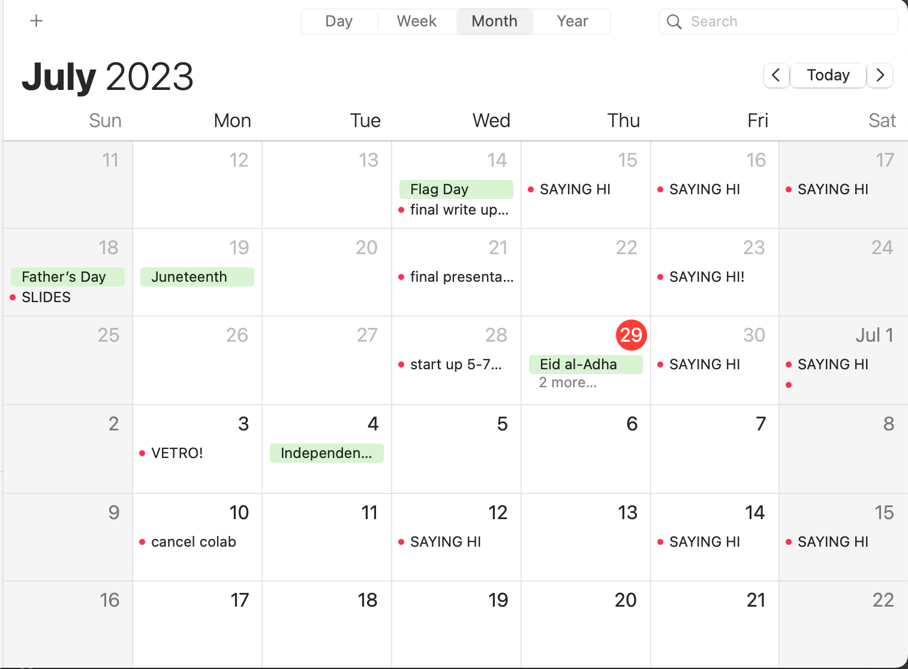
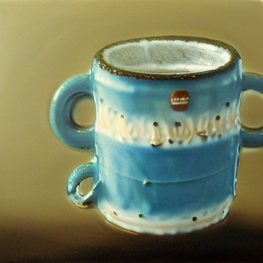

# SayingHi

This is a Potemkin Village of a project, I am trying to write 'hi' in the green squares where it shows your github activity. 

# June 29th
I am updating this readme with the following support documentation: 

For the record, I had the idea for this project after I noticed the first column three squares already existed, so this is sort of Day 2 of, oh shit I gotta do a git push today. 

While I'm here, wanna treat this is a kind of time-capsule/public journal/recording the State-of-Things-Now making this dumb project. 

### How I Got into Tech

I encountered github for the first time around two years ago. Was 'self-studying' over the summer, which basically meant sifting through marketing materials for boot camps and cold calling random friends and acquaintences who I thought might be in somewhat technical fields. 

Discovered Github at some point, but it was a bit of a disappointment then. The readmes were all written with assumed knowledge I didn't have, if I did even try to pull or fork anything I didn't get any futher than that, and it was all just very...confusing(sometimes still is). 

So then I almost did a bootcamp. Almost did two, one that would have started in July 2021, and another that would have started in September. This being 2021 they are all remote, which was one big reason I didn't bite the bullet. I was living with my parents, and, for the July one, I sort of did the math and realized that come December I would be: 10K-ish poorer, turning 30, living with my parents(having done this bootcamp, allegedly six hours of instruction or whatever a day, online, in my parent's house), and desperately looking for that first job. No thank you. 

I also should mention at this point two years ago I had the most money I'd ever had. Coffers are full. Coffers are full because of the Golden Unemployment of Covid, followed by full time employment while living with my parents, so what I did next was I went to Oaxaca, Mexico. My second or third day there I finished my application to Northeastern, which was a little daunting, because I was applying to Computer School and the form had a place to put Computer Experience and...

I mean, looking at it now I really should have lied. Or been more creative. Now after 18 months of grad school I see software through a wider lens and could brainstorm all kinds of things I did in the first 29 years of my life that would have been relevant on a form like this (using weird ticketing software for theatre festivals, making and updating a website, blogging intermitantly, etc (if you, reader, are thinking about getting into tech that might be an interesting place to start. Where is interfacing with sofware (or hardware) already a part of your life?). But they did let me in, and so I started school January 2022. 

Grad school has been an incredible priviledge in that it's been a time where I haven't had to worry about anything other than my own learning, and I've been able to dive head first into this world that has been eaten by software. More on all that tomorrow, Saturday, and then in two weeks. 

# June 30th

I really like this panda. 

It was made with stable diffusion, but as the result of tensor operations in an attempt to make meaningful changes to an image by making changes in the latent space of the text tensor. 

First, I made a (1,77,768) shape text encoding (using CLIP or whatever) of (call it dummy3) "painting of a normal sized panda bear". 

Then, I made two more text encodings, one (dummy1) for "painting of a normal sized polar bear", and one (dummy2) for "painting of a child-sized polar bear". 

Then, I iterated through dummy1 & dummy2 (all textual embeddings being the same shape), and when the raw tensor value for dummy2 was above some raw threshold, as well as greater than the raw value in the same spot in dummy2, I grabbed that value and its index in a hash map. 

Then, I iterated through dummy3 (our panda bear), and I did a lot of feature engineering so I honestly don't remember exactly what I did for this specific image, but I either straight up replaced the values that existed in the hashmap (made by comparing dummy1 to dummy2) when I got to those indices in dummy3, or I applied some scalar multiplication. 

None of this really worked the way I wanted to, but it felt so tantalizingly close, is my excuse why I don't remember exactly what feature engineering I was up to. 

My idea was to pass some essence of a concept only present in dummy2 on to dummy3, which I then actually turned into an image, using just tensor operations. 

**dummy1 = "painting of a normal sized polar bear"**

**dummy2 = "painting of a microscopic sized polar bear"**

**dummy3 = "painting of a normal sized panda bear"**

**What's displayed: dummy3 ~+ (dummy1 ~- dummy2)**

**dummy1 = "still life of banana and pineapple"**

**dummy2 = "still life of a banana"**

**dummy3 = "still life of a coffee mug"**

**What's displayed: dummy3 ~+ (dummy1 ~- dummy2)**

**dummy1 = "still life of pineapple and banana"**

**dummy2 = "still life of a pineapple"**

**dummy3 = "still life of a coffee mug"**

**What's displayed: dummy3 ~+ (dummy1 ~- dummy2)**

These were the successful images. There were probably 50+ unsuccessful images, which only made these limited successes more maddening. 

The more I read about just how stable diffusion works the more I think my naive ideas are just that. But it is interesting. And confusing. 

Like, for instance, here is a grid of the same textual embedding just scaled by a factor from 0.4 to 1.1. 

I mean, like, I multiplied the entire embedding by some arbitrary value. And we end up with this weird progression from almost sketch to more realistic. But no Guassian noise present in any of the images. And all of them relatively intelligible. So it's the in the relative values of the tensors that the information is encoded? 

I'm phrasing that as a question because if anyone reading this has a sense of what's going on I'd really love to know lol. 

# July 1st

### Small Creative Things

I buy junk electronics at the goodwill and take them home, and under the light of a screwy lamp that turns on and off by plugging unplugging it from the outlet (because I took it apart, and then couldn't put it back together quite right) I disassemble. 

I disassemble with lovely little specialty screw drivers. I unscrew and pull apart and try to only break the cosmetic plastic parts, and then only if I have to. When I get down as far as my abilities or curiousity will take me, there's sometimes awe. Sometimes not so much. 

I'm insecure about how little I can do. I successfully switched out little toy speakers once by splicing wires together. I have my Dad's soldering iron, but the thought of the airborn whatever drifting around my studio apartment stresses me out and I don't wanna go to all the trouble of ventilating properly. 

Mostly I just disassemble, and then either reassemle, or if that doesn't seem worthwhile I just put all the component parts in a big half-gallon clear plastic zip lock. I look up obscure fcc codes and read manuals. I watch strange youtube videos. I think about the data that lives in those little toys and I wish I could wave a wand and pull it out. I'm playing around with VCV Rack virtual synthesizers to learn the fundamentals so maybe I can start circuit bending these toy keyboards I'm accumulating. 

I am patient. I don't eat when I work and I wash my hands after touching all the weird components. I don't know what it is, but I feel I'm learning something. 

# July 12th

### Who knew getting added to an organization counts as activity?!?

Project is ruined. Which honestly I knew would happen, but I imagined it would be from forgetting. Started a new job last week, was added to the organization github, didn't think anything of it since I figured I certainly wouldn't be contributing any code in my first week (correct), but didn't realize I'd get a green check for just joining! Bummer. Whatever. 

Am on my lunch break right now and want to spend said lunch break not looking at a screen so this is all today. 

# July 14th

### Fri-Day Night

https://www.netflix.com/watch/80986859?t=600

# July 15th

### last push 

...

(edit for a demo thing)
